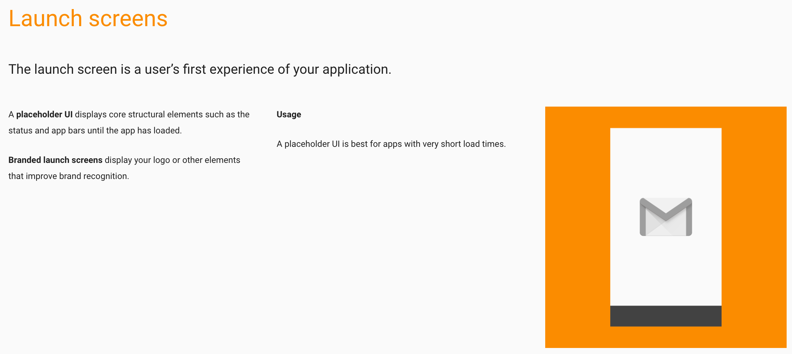
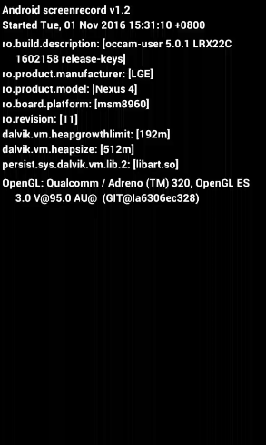
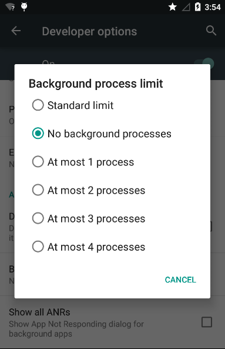
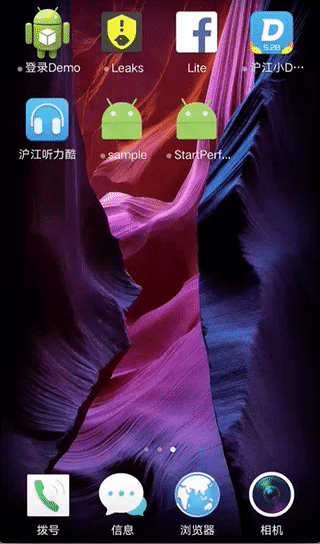

# 一触即发——App启动优化最佳实践

来源:[eclipsexys](http://blog.csdn.net/eclipsexys/article/details/53044990)

> 文中的很多图都是Google性能优化指南第六季中的一些截图

Google给出的优化指南来镇楼

[https://developer.android.com/topic/performance/launch-time.html](https://developer.android.com/topic/performance/launch-time.html)

## 闪屏定义

Android官方的性能优化典范，从第六季开始，发起了一系列针对App启动的优化实践，地址如下： 

[https://www.youtube.com/watch?v=Vw1G1s73DsY&index=74&list=PLWz5rJ2EKKc9CBxr3BVjPTPoDPLdPIFCE](https://www.youtube.com/watch?v=Vw1G1s73DsY&index=74&list=PLWz5rJ2EKKc9CBxr3BVjPTPoDPLdPIFCE)

可想而知，App的启动性能是非常重要的。同时，Google针对App闪屏，也给出了非常详细的设计定义，如下所示。

[https://material.google.com/patterns/launch-screens.html](https://material.google.com/patterns/launch-screens.html)



其实最早的时候，闪屏是用来在App未完全启动的时候，让用户不至于困惑App是否启动而加入的一个设计。而现在的很多App，基本上都把闪屏当做一个广告、宣传的页面了，貌似已经失去了原本的意义，但闪屏，不管怎么说，在一个App启动的时候，都是非常重要的，设计的事情，交给UE吧，开发要做的，就是让App的启动体验，做到最好。

## App启动流程

App启动的整个过程，可以分解成下面几个过程：

* 1、用户在Launcher上点击App Icon
* 2、系统为App创建进程，显示启动窗口
* 3、App在进程中创建自己的组件

这个过程可以用下面这幅图来描述：


而我们能够优化的，也就是下面Application的创建部分，系统的进程分配以及一些窗口切换的动画效果等，都是跟ROM相关的，我们无法处理。所以，我们需要把重点放到Application的创建过程。

上面是官方的说明，下面我们用更加通俗的语言来解释一遍。

当用户点击桌面icon的时候，系统准备好了，给App分配进程空间，就好像去酒店开房，但是你又不能直接进入房间，你得坐电梯去房间，那么你坐电梯的这个时间，实际上就是系统的准备时间，那么系统的这个准备时间一般来说不会太长，但假如的开的是一个总统套房呢，系统就得花不少时间来打理，所以系统给所有用户都准备了一个过渡界面，这个界面，就是启动时的黑屏\白屏，也就是你坐电梯里面看的小广告，看完小广告，你就到房间了，然后你想干嘛都可以了，这个想干嘛的速度，就完全取决于你开门的速度了，你门开得快，自然那啥快，所以这里是开发者可以优化的地方，有些开发者掏个钥匙要好几秒，有的只要几百毫秒，完全影响了后面那啥的效率。

那么一般来说，故事到这里就结束了，但是，系统，也就是这个酒店，并不是一个野鸡酒店，他也想尽量做得让顾客满意，这样才会有回头客啊，所以，酒店做了一个优化，可以让每个顾客自己定义在坐电梯的时候想看什么！也就是说，系统在加载App的时候，首先是加载了资源文件，这里就包括了要启动的Activity的Theme，而这个Theme呢，是可以自定义的，也就是顾客在坐电梯时想看的东西，而不是千篇一律的白屏或者黑屏，他可以定制很多东西，例如ActionBar、背景、StatusBar等等。

## 启动时间的测量

### 关于Activity启动时间的定义

对于Activity来说，启动时，首先执行的是onCreate()、onStart()、onResume()这些生命周期函数，但即使这些生命周期方法回调结束了，应用也不算已经完全启动，还需要等View树全部构建完毕，一般认为，setContentView中的View全部显示结束了，算作是应用完全启动了。

### Display Time

从API19之后，Android在系统Log中增加了Display的Log信息，通过过滤ActivityManager以及Display这两个关键字，可以找到系统中的这个Log：

> $ adb logcat | grep “ActivityManager”<br/>
> ActivityManager: Displayed com.example.launcher/.LauncherActivity: +999ms

抓到的Log如图所示：


那么这个时间，实际上是Activity启动，到Layout全部显示的过程，但是要注意，这里并不包括数据的加载，因为很多App在加载时会使用懒加载模式，即数据拉取后，再刷新默认的UI。

### reportFullyDrawn

前面说了，系统日志中的Display Time只是布局的显示时间，并不包括一些数据的懒加载等消耗的时间，所以，系统给我们定义了一个类似的『自定义上报时间』——reportFullyDrawn。

同样是借用Google的一张图来说明：


reportFullyDrawn是由我们自己调用的，一般在数据全部加载完毕后，手动调用，这样就会在Log中增加一条日志：

> $ adb logcat | grep “ActivityManager”<br/>
> ActivityManager: Displayed com.example.launcher/. LauncherActivity: +999ms<br/> ActivityManager: Fully drawn com.example.launcher/. LauncherActivity: +1s999ms

一般来说，使用的场景如下：

```
public class MainActivity extends AppCompatActivity 
				implements LoaderManager.LoaderCallbacks<Void> {

    @Override
    protected void onCreate(Bundle savedInstanceState) {
        super.onCreate(savedInstanceState);
        setContentView(R.layout.activity_main);
    }

    @Override
    public void onLoadFinished(Loader<Void> loader, Void data) {
        // 加载数据
        // ……
        // 上报reportFullyDrawn
        reportFullyDrawn();
    }

    @Override
    public Loader<Void> onCreateLoader(int id, Bundle args) {
        return null;
    }

    @Override
    public void onLoaderReset(Loader<Void> loader) {

    }
}
```

但是要注意，这个方式需要API19+，所以，这里需要对SDK版本进行判断。

### 计算启动时间——ADB

通过ADB命令可以统计应用的启动时间，指令如下所示：

> ➜  ~  adb shell am start -W com.xys.preferencetest/.MainActivity
Starting: Intent { act=android.intent.action.MAIN cat=[android.intent.category.LAUNCHER] cmp=com.xys.preferencetest/.MainActivity }<br/>
> Status: ok<br/>
> Activity: com.xys.preferencetest/.MainActivity<br/>
> ThisTime: 1047<br/>
> TotalTime: 1047<br/>
> WaitTime: 1059<br/>
> Complete<br/>

该指令一共给出了三个时间：

* **ThisTime**:最后一个启动的Activity的启动耗时
* **TotalTime**:自己的所有Activity的启动耗时
* **WaitTime**: ActivityManagerService启动App的Activity时的总时间（包括当前Activity的onPause()和自己Activity的启动）

这三个时间不是很好理解，我们可以把整个过程分解:

*1.上一个Activity的onPause()——2.系统调用AMS耗时——3.第一个Activity（也许是闪屏页）启动耗时——4.第一个Activity的onPause()耗时——5.第二个Activity启动耗时*

那么，ThisTime表示5（最后一个Activity的启动耗时）。TotalTime表示3.4.5总共的耗时（如果启动时只有一个Activity，那么ThisTime与TotalTime应该是一样的）。WaitTime则表示所有的操作耗时，即1.2.3.4.5所有的耗时。

每次给出的时间可能并不一样，而且应用从首次安装启动到后面每次正常启动，时间都会不同，区别于系统是否要分配进程空间。

### 计算启动时间——Screen Record

通过录屏进行启动的分析，是一个很好的办法，在API21+，Android给我们提供了一个更加方便、准确的方式：

> ➜  ~ adb shell screenrecord --bugreport /sdcard/test.mp4

Android在screenrecord中新增了一个参数——bugreport，那么加了这个参数之后，录制出来的视频，在左上角就会增加一行数字的显示，如图所示。

在视频开始前，会显示设备信息和一些参数：



视频开始后，左上角会有一行数字：


例如图中的：15:31:22.261 f=171(0)

其中，前面的4个数字，就是时间戳，即15点31分22秒261，f=后面的数字是当前的帧数，注意，不是帧率，而是代表当前是第几帧，括号中的数字，代表的是『Dropped frames 
count』，即掉帧数。

有了这个东西，再结合视频就可以非常清楚的看见这些信息了。

## 启动时间的调试

### 模拟启动延时

在测试的时候，我们可以通过下面的方式来进行启动的延迟模拟：

> SystemClock.sleep(2000)

或者直接通过:

```
try {
    Thread.sleep(2000);
} catch (InterruptedException e) {
    e.printStackTrace();
}
```

或者通过：

```
new Handler().postDelayed(new Runnable() {
    @Override
    public void run() {
        // Delay
    }

}, 2000);
```

这些方案都可以进行启动延迟的模拟。

### 强制冷启动

在『开发者选项』中的**Background Process Limit**中设置为**No Background Processes**



## 优化点

### Static Block

很多代码中的Static Block，都是做一些初始化工作，特别是ContentProvider中在Static Block中初始化一些UriMatcher，这些东西可以做成懒加载模式。

### Application

Application是程序的主入口，特别是很多第三方SDK都会需要在Application的onCreate里面做很多初始化操作，不得不说，各种第三方SDK，都特别喜欢这个『兵家必争之地』，再加上自己的一些库的初始化，会让整个Application不堪重负。

优化的方法，无非是通过以下几个方面：

* 延迟初始化
* 后台任务
* 界面预加载

### 阻塞

阻塞有很多种情况，例如磁盘IO阻塞（读写文件、SharedPerfences）、网络阻塞（现在应该不会了）以及高CPU占用的代码（加解密、渲染、解析等等）。

### View层级

见《Android群英传》

### 耗时方法

通过使用TraceView && Systrace && Method Tracing工具来进行排查，见《Android群英传:神兵利器》

## App启动优化的一般过程

1. 通过TraceView、Systrace来分析耗时的方法与组件。
2. 梳理启动加载的每一个库、组件。
3. 将梳理出来的库，按功能和需求进行划分，设计该库的启动时机。
4. 与交互沟通，设计启动画面，按前文方法进行优化。

## 解决方案

### Theme

当系统加载一个Activity的时候，onCreate()是一个耗时过程，那么在这个过程中，系统为了让用户能有一个比较好的体验，实际上会先绘制一些初始界面，类似于PlaceHolder。

系统首先会读取当前Activity的Theme，然后根据Theme中的配置来绘制，当Activity加载完毕后，才会替换为真正的界面。所以，Google官方提供的解决方案，就是通过android:windowBackground属性，来进行加载前的配置，同时，这里不仅可以配置颜色，还能配置图片，例如，我们可以使用一个layer-list来作为android:windowBackground要显示的图：

start_window.xml

```
<layer-list xmlns:android="http://schemas.android.com/apk/res/android"
            android:opacity="opaque">
    <item android:drawable="@android:color/darker_gray"/>
    <item>
        <bitmap
            android:gravity="center"
            android:src="@mipmap/ic_launcher"/>
    </item>
</layer-list>
```

可以看见，这里通过layer-list来实现图片的叠加，让开发者可以自由组合。

> 配置中的android:opacity=”opaque”参数是为了防止在启动的时候出现背景的闪烁。

接下来可以设置一个新的Style，这个Style就是Activity预加载的Style。

```
<resources>

    <!-- Base application theme. -->
    <style name="AppTheme" parent="Theme.AppCompat.Light.DarkActionBar">
        <!-- Customize your theme here. -->
        <item name="colorPrimary">@color/colorPrimary</item>
        <item name="colorPrimaryDark">@color/colorPrimaryDark</item>
        <item name="colorAccent">@color/colorAccent</item>
    </style>

    <style name="StartStyle" parent="AppTheme">
        <item name="android:windowBackground">@drawable/start_window</item>
    </style>
</resources>
```

OK，下面在Mainifest中给Activity指定需要预加载的Style：

```
<?xml version="1.0" encoding="utf-8"?>
<manifest xmlns:android="http://schemas.android.com/apk/res/android"
          package="com.xys.startperformancedemo">

    <application
        android:allowBackup="true"
        android:icon="@mipmap/ic_launcher"
        android:label="@string/app_name"
        android:supportsRtl="true"
        android:theme="@style/AppTheme">
        <activity
            android:name=".MainActivity"
            android:theme="@style/StartStyle">
            <intent-filter>
                <action android:name="android.intent.action.MAIN"/>

                <category android:name="android.intent.category.LAUNCHER"/>
            </intent-filter>
        </activity>
    </application>

</manifest>
```

这里需要注意下，一定是Activity的Theme，而不是Application的Theme。

最后，我们在Activity加载真正的界面之前，将Theme设置回正常的Theme就好了：

```
public class MainActivity extends AppCompatActivity {

    @Override
    protected void onCreate(Bundle savedInstanceState) {
        setTheme(R.style.AppTheme);
        super.onCreate(savedInstanceState);
        SystemClock.sleep(2000);
        setContentView(R.layout.activity_main);
    }
}
```

在这个Activity中，我使用`SystemClock.sleep(2000)`，模拟了一个Activity加载的耗时过程，在`super.onCreate(savedInstanceState)`调用前，将主题重新设置为原来的主题。

通过这种方式设置的效果如下：



启动的时候，会先展示一个画面，这个画面就是系统解析到的Style，等Activity加载完全完毕后，才会加载Activity的界面，而在Activity的界面中，我们将主题重新设置为正常的主题，从而达到一个友好的启动体验，这种方式其实并没有真正的加速启动过程，而是通过交互体验来优化了展示的效果。

### 异步初始化

这个很简单，就是让App在onCreate里面尽可能的少做事情，而利用手机的多核特性，尽可能的利用多线程，例如一些第三方框架的初始化，如果能放线程，就尽量的放入线程中，最简单的，你可以直接new Thread()，当然，你也可以通过公共的线程池来进行异步的初始化工作，这个是最能够压缩启动时间的方式

### 延迟初始化

延迟初始化并不是减少了启动时间，而是让耗时操作让位、让资源给UI绘制，将耗时的操作延迟到UI加载完毕后，所以，这里建议通过mDecoView.post方法，来进行延迟加载，代码如下：

```
getWindow().getDecorView().post(new Runnable() {

  @Override public void run() {
    ……
  }
});
```

我们的ContentView就是通过mDecoView.addView加入到根布局的，所以，通过这种方式，可以让延迟加载的内容，在ContentView初始化完毕后，再进行执行，保证了UI绘制的流畅性。

### IntentService

IntentService是继承于Service并处理异步请求的一个类，在IntentService的内部，有一个工作线程来处理耗时操作，启动IntentService的方式和启动传统Service一样，同时，当任务执行完后，IntentService会自动停止，而不需要去手动控制。

```
public class InitIntentService extends IntentService {

    private static final String ACTION = "com.xys.startperformancedemo.action";

    public InitIntentService() {
        super("InitIntentService");
    }

    public static void start(Context context) {
        Intent intent = new Intent(context, InitIntentService.class);
        intent.setAction(ACTION);
        context.startService(intent);
    }

    @Override
    protected void onHandleIntent(Intent intent) {
        SystemClock.sleep(2000);
        Log.d(TAG, "onHandleIntent: ");
    }
}
```

我们将耗时任务丢到IntentService中去处理，系统会自动开启线程去处理，同时，在任务结束后，还能自己结束Service，多么的人性化！OK，只需要在Application或者Activity的onCreate中去启动这个IntentService即可：

```
@Override
protected void onCreate(Bundle savedInstanceState) {
    super.onCreate(savedInstanceState);
    setContentView(R.layout.activity_main);
    InitIntentService.start(this);
}
```

最后不要忘记在Mainifest注册Service。

### 使用ActivityLifecycleCallbacks

Framework提供的这个方法可以监控到所有Activity的生命周期，在这里，我们就可以通过onActivityCreated这样一个回调，来将一些UI相关的初始化操作放到这里，同时，通过unregisterActivityLifecycleCallbacks来避免重复的初始化。同时，这里onActivityCreated回调的参数Bundle，可以用来区别是否是被系统所回收的Activity。

```
public class MainApplication extends Application {

    @Override
    public void onCreate() {
        super.onCreate();
        // 初始化基本内容
        // ……
        registerActivityLifecycleCallbacks(new ActivityLifecycleCallbacks() {
            @Override
            public void onActivityCreated(Activity activity, 
            				Bundle savedInstanceState) {
                unregisterActivityLifecycleCallbacks(this);
                // 初始化UI相关的内容
                // ……
            }

            @Override
            public void onActivityStarted(Activity activity) {
            }

            @Override
            public void onActivityResumed(Activity activity) {
            }

            @Override
            public void onActivityPaused(Activity activity) {
            }

            @Override
            public void onActivityStopped(Activity activity) {
            }

            @Override
            public void onActivitySaveInstanceState(Activity activity, 
            				Bundle outState) {
            }

            @Override
            public void onActivityDestroyed(Activity activity) {
            }
        });
    }
}
```

### 资源优化

有几个方面，一个自然是优化布局、布局层级，一个是优化资源，尽可能的精简资源、避免垃圾资源，这些可以通过混淆和tinyPNG这些工具来实现。

### 甩锅方案

下面是两种不同的方案，都是在Style中进行配置：

```
<item name="android:windowDisablePreview">true</item>
```

与

```
<item name="android:windowIsTranslucent">true</item>
<item name="android:windowNoTitle">true</item>
```

我们先来看看这样做的效果：


设置效果类似，即通过取消、透明化系统的统一的加载页面来达到启动的『加速』，实际上，是一个『甩锅』的过程。强烈建议开发者不要通过这种方式去做『所谓的启动加速』,这种方式虽然看上去自己的App启动非常快，瞬间就完成了，但实际上，是将真正的启动界面给隐藏了。

> 系统说：这锅，我们不背！

### 无解

对应5.0以下的65535问题，目前只能通过Multidex来进行处理，而在5.0以下的机器上，系统在加载前的合并Dex的过程，有可能非常长，这也是暂时无解的问题，只能希望后面Multidex进行优化。

OK，App的启动优化基本如上，其重点过程，依然是分析耗时的操作，以及如何设计合理的启动顺序，希望各位能够通过文中介绍的方式来进行App的启动优化。

更多内容，请关注我的微信公众号：

